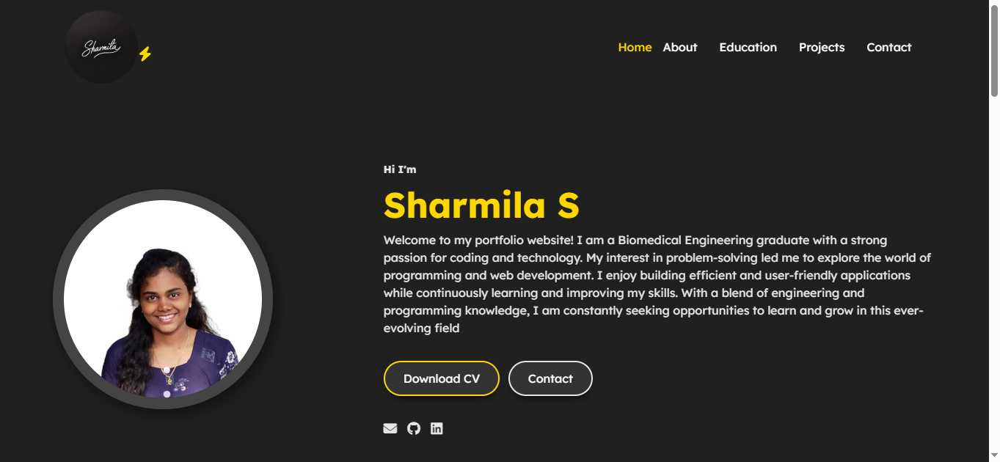
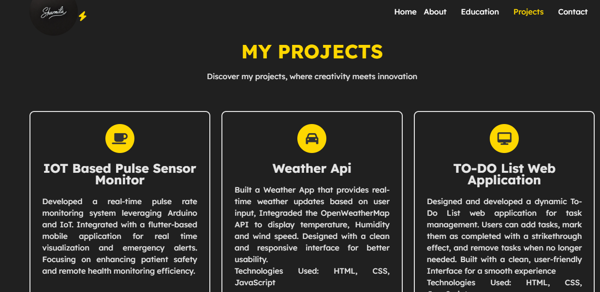

 🌐 My Portfolio Website

Welcome to my personal portfolio website! This project showcases my skills, experience, and projects in web development and programming.

 🚀 About Me
I am a web developer with experience in HTML, CSS, JavaScript, Java, and MySQL. Passionate about creating responsive and interactive web applications.

🏗 Features
- Home Page - Introduction and navigation.
- Skills Section - Highlights my programming and web development skills.
- Education & Experience - Showcases my academic background and professional experience.
- Projects - Displays my best projects with images and descriptions.
- Contact Form - Allows visitors to reach out to me.

 🛠 Technologies Used
- HTML5, CSS3, JavaScript
- Responsive Web Design

 📸 Homepage Preview  

 📸 Projects Section Preview  

